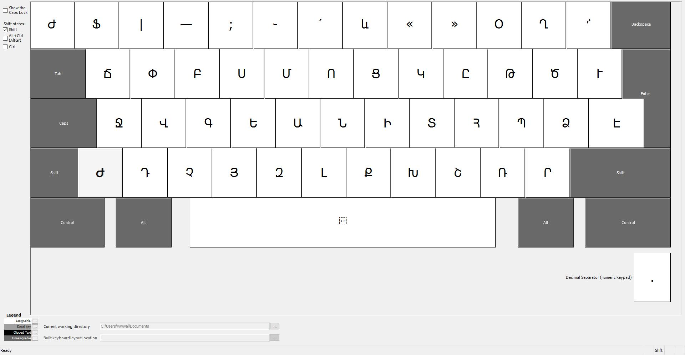
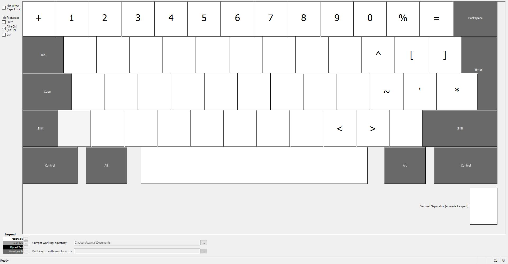

# Armenian-Keyboard
A keyboard layout based on "Armenian Typewriter" layout for Windows. This maximally ressambles the classical 1900s Armenian alphabetic typewriters layout. This is an ISO layout, but fully compatitable to ANSI and other standards. The first layout which unifies Eastern and Western Armenian layout for the typewriter layout with modifying the standard Windows (and even ArmSCII) one to revert maximally to the classic order. 

  

      
      
Normal

  

  

      
      
On Shift only

  

    

      
      
On AltGr

  

    

      
      
On Shift and AltGr

  

